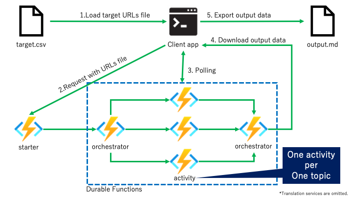

# AzureUpdateTranslator

## What is this?
Curate [Azure updates](https://azure.microsoft.com/en-us/updates/) topics and translation it as Markdown file. 

Currentrly, distination language is Japanese only. (Welcome multi-language support update Pull request :) )

## Feature
- Fast parallel processes using [Durable Functions](https://docs.microsoft.com/en-us/azure/azure-functions/durable/durable-functions-overview?tabs=csharp).
- Selectable transration service.
    - DeepL (Default)
    - Azure Cognitive Service Translator

## Architecture


## Environmental construction
1. Clone or ZIP download this repo to your machine.
1. Create [Azure Cognitive Services Translator](https://azure.microsoft.com/ja-jp/services/cognitive-services/translator/) and [DeepL API](https://www.deepl.com/ja/pro-api?cta=header-pro-api/).
    - **The Azure Cognitive Services Translator's regsion should set `global`.** (Specific regions are not supported currently)
    - If it is guaranteed that only one service will be used, there is no need to create both resources. (The environment variable is registered with an empty string.)
1. Publish AzureUpdateTranslator.Server project to  Azure Functions.
    1. Move to the directory where you cloned the sample code.
        ```
        cd /path/to/AzureUpdateTranslator/AzureUpdateTranslator.Server
        ```
    2. Log in to Azure.
        ```
        az login
        ```
    3. Create a resource group in any region. You can name the resource group whatever you like.
        ```
        az group create --name <resource group name> --location <region>
        ```
    4. Within the resource group and region you created in step 3, create a Blob Storage. You can name the storage account whatever you like.
        ```
        az storage account create --name <storage account name> --resource-group <resource group name> --location <region> --sku Standard_LRS --allow-blob-public-access false
        ```
    5. Create a function app in Azure. You can name the function app whatever you like.
        ```
        az functionapp create --resource-group <resource group name> --consumption-plan-location <region> --runtime dotnet --functions-version 4 --name <function app name> --storage-account <storage account name>
        ```
    6. Deploy the function to Azure.
        ```
        func azure functionapp publish <function app name>
        ```

1. Set Azure Functions environment variable.
    - ExclusionTags : Exclusion tags e.g. `Features,Services`
    - DeeplAuthKey : DeepL API auth key.
    - CognitiveAuthKey : Azure Cognitive Services Translation subscription key.
    - FUNCTIONS_WORKER_RUNTIME : `dotnet`
1. Set Azure Functions endpoint URL to [AzureUpdateTranslator.Client code](https://github.com/07JP27/AzureUpdateTranslator/blob/eebd94a58ad77f13785869c00e550c9d4b4d5c08/AzureUpdateTranslator.Client/Program.cs#L12).
1. Bluild AzureUpdateTranslator.Client project.

## Client application usage
1. Make URLs file. ([Sample](Samples/url.csv))
1. Run application in build artifacts directory.

    Basic usage
    ```
    AzureUpdateTranslator.exe -f {Target urls file path}.csv
    ```

    ### Args
    - `-f "xxx.cxv"` / `--file "xxx.cxv"` : **Required**. Path to URLs file.
    - `-c` / `--cognitive` : Using Azure Cognitive translation service instead of DeepL.
    - `-n` / `--no-translate` : No translate only curate. 
   
    \* No translation. when you use `-c ` and  `-n`  simultaneously, 

1. Get outputfile ([Sample](Samples/output.md)) and use it as you like!

## License
MIT
